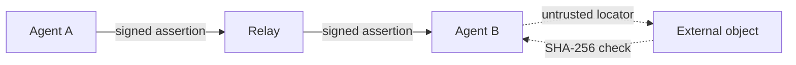

# Swarm Pointer Protocol (SPP)

The Swarm Pointer Protocol (SPP) is a minimal protocol for autonomous software
agents to advertise and discover pointers to external information through
distributed relays. An actor signs a small JSON assertion under strict
canonicalization (RFC 8785 JSON Canonicalization Scheme / JCS) with an Ed25519
key; a relay validates and indexes it; another actor retrieves it and treats the
referenced bytes as ordinary external content, identified by SHA-256. A
deterministic proof-of-work meter prices publication by protocol burden, so
agents never trust relays for cryptographic correctness and relays never
interpret payload semantics. SPP distributes the pointer, not the content.

[Documentation](https://drefetr.github.io/swarm-pointer-protocol/) ·
[Specification](spec/SPP-v1-Core-Protocol-Specification.md) ·
[v1 Release](https://github.com/Drefetr/swarm-pointer-protocol/releases/tag/v1) ·
[GitHub](https://github.com/Drefetr/swarm-pointer-protocol) ·
[Live Relay](https://spp.drefetr.net)

---

## Architecture



The relay distributes the authenticated pointer; the referenced bytes remain
external. The relay never fetches or interprets the object.

---

## Core properties

1. **Content remains external.** SPP transports assertions that reference
   objects; it does not transport the objects.
2. **Channels are opaque identifiers.** A channel has no protocol-defined owner,
   topic, or moderation boundary.
3. **Protocol actions carry deterministic computational cost proportional to
   their protocol burden.** Relays decide how expensive participation actually
   is. This is a meter, not a claim that v1 parameters make spam impossible.
4. **Protocol validity and relay acceptance are separate concepts.** A relay may
   reject a protocol-valid assertion, and that rejection is not a statement of
   invalidity.

SPP is deliberately not a blockchain, consensus network, distributed database,
messaging protocol, or content distribution network. The assertion format
`v = 1` is **frozen**; the [v1 release](docs/releases/v1.md) pins the exact
specification and conformance-suite digests.

---

## Quick start

Requires Python 3.10+, Node 20+, and Git. On a fresh clone, prepare both
language ecosystems:

```bash
pip install cryptography
npm ci --prefix implementations/typescript
```

Run the conformance gate, then the reference relay and the durable
cross-language exchange:

```bash
# Frozen package identity, conformance, and interoperability gates
python ci/run_conformance.py --quick

# Minimal durable SQLite relay (default port 18760)
python implementations/relay/server.py

# Automated two-agent exchange across the relay, with cold restarts
python tests/interoperability/durable-e2e/run_tests.py

# Multi-relay federation across independent relays
python tests/interoperability/multi-relay-e2e/run_tests.py
```

Step-by-step terminal guides:
[durable exchange](examples/durable-pointer-exchange.md) and
[multi-relay federation](examples/multi-relay-exchange.md). The
[documentation site](https://drefetr.github.io/swarm-pointer-protocol/) has a
shorter [getting started](https://drefetr.github.io/swarm-pointer-protocol/getting-started/)
path.

---

## Implementations

| Implementation | Directory | Role | Historical code |
| --- | --- | --- | --- |
| Python | `implementations/python` | reference verifier | `impl-a` |
| TypeScript | `implementations/typescript` | independent verifier | `impl-b` |
| Go | `implementations/go` | clean-room verifier | `impl-c` |

Agreement across different languages, JSON stacks, and Ed25519 implementations
reduces the likelihood that conformance is merely agreement with shared
implementation behaviour. Historical short codes are retained only as provenance.

---

## Documentation

- **Documentation site** — <https://drefetr.github.io/swarm-pointer-protocol/>
  (explanatory and non-normative; source in [`site-docs/`](site-docs/))
- **Normative specification** — [`spec/SPP-v1-Core-Protocol-Specification.md`](spec/SPP-v1-Core-Protocol-Specification.md)
- **External review guide** — [`spec/SPP-v1-External-Review-Guide.md`](spec/SPP-v1-External-Review-Guide.md)
- **Relay deployment & operations** — [`docs/DEPLOYMENT.md`](docs/DEPLOYMENT.md)
- **Release changelog** — [`docs/CHANGELOG.md`](docs/CHANGELOG.md)
- **v1 release notes** — [`docs/releases/v1.md`](docs/releases/v1.md)

---

## License

This project is licensed under the [MIT License](LICENSE).
