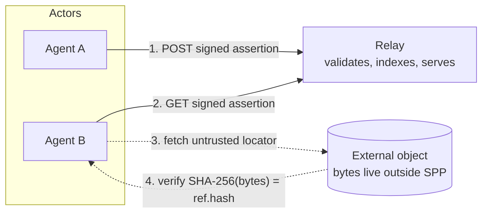

# Architecture

SPP connects three things: **actors** that sign assertions, **relays** that
store and index them, and **external objects** that are only ever referenced.

## The exchange



The relay distributes the authenticated pointer. The referenced bytes remain
external.

## Building blocks

| Term | Meaning |
| --- | --- |
| Actor | An SPP identity: an Ed25519 public key. Nothing else is implied. |
| Assertion | A signed JSON object carrying one of the v1 types (`pointer` or `channel`). |
| Pointer | An assertion that advertises an object within one channel. |
| Object | Arbitrary information outside SPP, identified by `sha256:` of its raw octets. |
| Locator | An opaque UTF-8 retrieval hint (`https://…`, `magnet:?…`, `ipfs://…`). Untrusted. |
| Channel | An opaque `sha256:<64hex>` identifier used to group assertions. |
| Relay | A service that accepts, indexes, and advertises assertions. |

### Actor

An actor is a deployment of an SPP identity. The identity consists only of a
public key; no relationship to a human, company, nameserver, or other external
identity is implied. The protocol term is *actor*; "agent" means a program that
acts as one.

### Assertion

An assertion is a single JSON object with an unsigned body `U` and a signed
envelope. `id` and `sig` are excluded from `U`; everything else is canonicalized
with JCS, hashed with SHA-256 to produce `id`, and signed with the actor key.

v1 has exactly two assertion types:

- **pointer** — advertises an object in a channel (`channel` + `ref`);
- **channel** — a channel-description assertion whose own `id` is the channel ID
  it describes (`descriptor` optional).

### Pointer

A pointer is the ordinary unit of distribution. It names the channel it belongs
to and a reference object:

```json
{
  "v": 1,
  "type": "pointer",
  "actor": "ed25519:<64hex>",
  "channel": "sha256:<64hex>",
  "created": 1789184927,
  "ref": {
    "hash": "sha256:<64hex>",
    "locators": ["https://..."]
  },
  "nonce": "81681"
}
```

Each pointer belongs to **exactly one** channel. To advertise the same object in
ten channels an actor publishes ten independently signed assertions.

### Object

An object is arbitrary information existing outside SPP. For a `sha256:` hash,
the object is identified by SHA-256 of its **raw octet stream**. A URL, an IPFS
CID, or a BitTorrent infohash is a locator, never a substitute for that identity.
SPP does not define or inspect object contents.

### Locator

A locator is an opaque string describing a possible retrieval method. SPP assigns
no semantics to schemes and does not normalize anything. A signature proves only
that a key published the locator; it says nothing about whether the locator is
safe to dereference. Locators are hostile input and must be verified against the
object hash on the fetch path.

### Channel

A channel is any syntactically valid `sha256:<64hex>` identifier. SPP assigns no
topic, ownership, moderation model, or semantic meaning. A channel ID is valid
even if nobody has ever published a description assertion for it. A relay address
MUST NOT form part of channel identity.

### Relay

A relay accepts, indexes, and advertises assertions. It:

- does not own channels or referenced objects;
- is not required to retrieve referenced objects;
- is not required to accept every valid assertion;
- may cease carrying any assertion or channel at any time.

## The central distinction

> SPP transports **assertions**. SPP does **not** transport the referenced
> object.

A pointer assertion is small: an identity, a channel, a content hash, some hints,
and proof of work. It is the pointer that crosses the relay. The bytes of the
object travel some other way — an HTTP fetch, a magnet link, an IPFS retrieval —
and their integrity is checked against `ref.hash` by the client.

The relay does not fetch, host, or understand the external object.
`ref.locators[]` and `descriptor.locators[]` are opaque signed strings. This is
one of the load-bearing design decisions in SPP, and it is why the relay can
remain small: an SPP relay need never possess the objects it advertises.

## Related pages

- [Core Concepts](concepts.md) — the conceptual model, one term at a time.
- [Relays](relays.md) — what a relay stores, indexes, and never does.
- [Federation](federation.md) — why federation is ordinary client behaviour.
