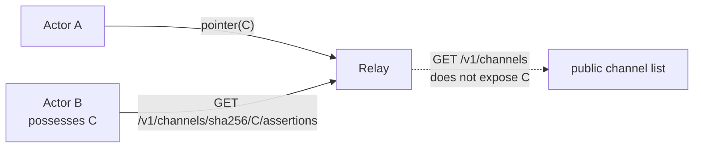
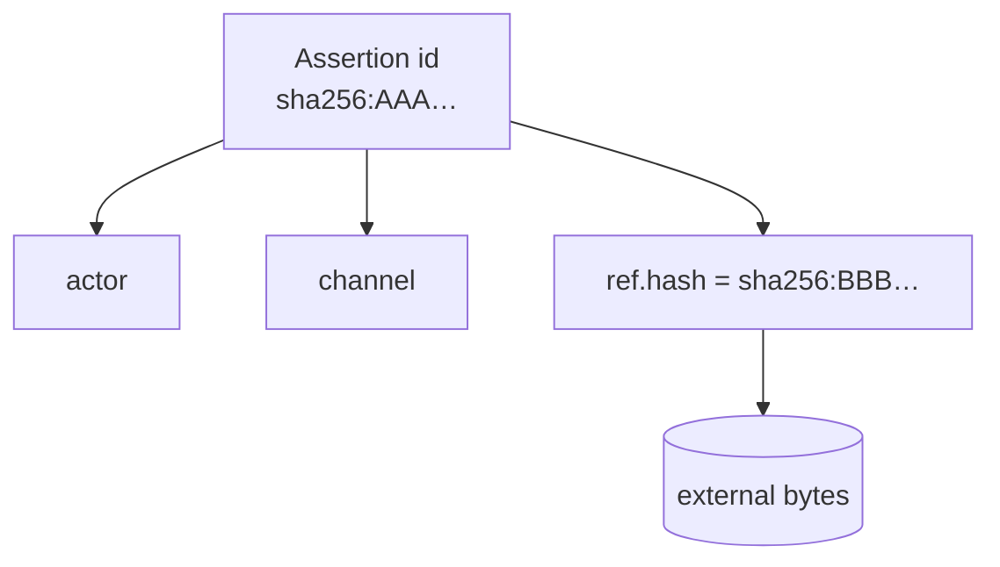

# Core Concepts

This page explains the v1 conceptual model one term at a time. Each concept is
described as **what it is** and **what it is not**. For the exact normative rules
see the [frozen specification][spec].

[spec]: https://github.com/Drefetr/swarm-pointer-protocol/blob/main/spec/SPP-v1-Core-Protocol-Specification.md

## Actors

**Is:** an Ed25519 public key, written `ed25519:<64hex>`. An actor is whoever
holds the corresponding private key, and assertion authorship is proven by
signature.

**Is not:** an account, a username, a reputation, a human identity, a
registration, or an access-control subject. Keys are cheap, so an actor identity
does not by itself establish trust.

## Objects

**Is:** arbitrary information existing outside SPP, identified by
`sha256:<64hex>` — the SHA-256 of the object's raw octet stream.

**Is not:** anything SPP stores, transports, inspects, or interprets. A URL or
content-addressed locator embedded in a locator string is not object identity.

## Locators

**Is:** an opaque UTF-8 retrieval hint. Examples include `https://…`,
`magnet:?…`, and `ipfs://…`.

**Is not:** object identity, a trust signal, or a guarantee of availability or
safety. A signature says a key published the locator; it says nothing about
whether fetching it is safe. Locators are hostile input.

## Channels

**Is:** an opaque `sha256:<64hex>` identifier that groups assertions.

**Is not:** an account, a topic controlled by an owner, a moderation boundary, a
membership object, or a relay-owned namespace. Any actor may publish pointers
into any well-formed channel ID, subject to relay policy.

A channel ID is valid even if nobody has ever published a channel-description
assertion for it. A **capability / unlisted channel** is simply a `sha256:` ID
whose 256 bits are cryptographically random and not advertised. Possession of the
ID provides discoverability only — never confidentiality, access control,
membership, or write authorization.

Possession of the opaque channel ID provides discoverability. It does not
establish ownership, membership, or authorization.

## Pointers

**Is:** a `type=pointer` assertion that advertises an object within exactly one
channel, via `channel` and a reference object `ref` (`hash` + `locators`).

**Is not:** a message, an event, or a container for application data. Application
metadata, if any, lives only under the optional authenticated `ext` member and has
no v1 protocol semantics.

Each pointer belongs to one channel. Fan-out across channels means publishing
independently signed assertions.

## Channel descriptions

**Is:** a `type=channel` assertion that announces or describes a channel whose ID
**is that assertion's own ID**. An optional `descriptor` reference object points
at external information describing the channel; SPP does not interpret it.

**Is not:** the creation of a channel, an ownership claim, or a requirement for
pointers. An independently chosen random capability ID cannot later acquire a
matching `type=channel` assertion short of a SHA-256 preimage. Possessing a
channel-description assertion is never required for a pointer to be valid.

## Parents

**Is:** an optional list of `sha256:` IDs on a pointer assertion, interpreted by
clients as hints.

**Is not:** a causal relationship, an ordering, a same-channel guarantee, or
something a relay must resolve. Parents may name unknown IDs, IDs in other
channels, or form cycles.

## Proof of work

**Is:** a deterministic cost meter. Every assertion carries a `nonce`; validity
requires the assertion digest `H` to satisfy `H <= target`, where `target` is
derived from the assertion's protocol burden (`units`). One unit is 65536
expected SHA-256 attempts. Work scales with canonical body size, locator count,
parent count, and channel-description cost.

**Is not:** an anti-spam guarantee, a proof of recent work, or a consensus
mechanism. It is a meter: one publication costs X, one hundred cost about 100X,
before any relay multiplier. Stockpiled work is allowed. Relays may require more
work as local policy, and an assertion rejected by one relay remains
protocol-valid and may be accepted by another.

## Assertion identity vs object identity

An assertion's `id` and the object's `ref.hash` are **independent** values.
`id` is the SHA-256 of the canonicalized assertion; `ref.hash` is the SHA-256 of
the external bytes.

Consequences:

- **assertion ID ≠ object hash** — they hash different byte strings;
- **multiple assertions may point at one object** — distinct actors, channels,
  timestamps, or locators all change the assertion but not the object;
- **one object may have multiple locators** — any actor may publish another
  pointer to the same `ref.hash` with different hints ([locator
  repair](https://github.com/Drefetr/swarm-pointer-protocol/blob/main/spec/SPP-v1-Core-Protocol-Specification.md#25-locator-repair)).

!!! tip "Why this matters"
    A live cross-language exchange demonstrated two different assertions
    pointing to the same object. Identity of the pointer and identity of the
    content are deliberately separate.
