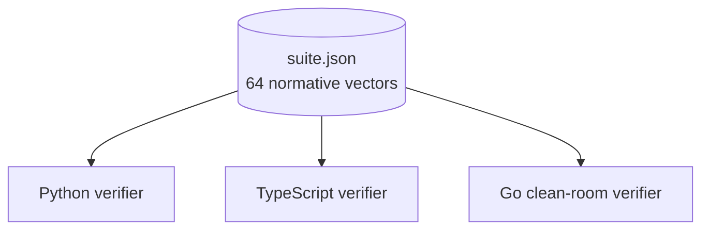

# Conformance

The frozen v1 release carries a machine-readable normative suite of **64
vectors**. Each implementation consumes that committed artifact as fixed bytes;
implementations never regenerate expected results from their own logic.



## What "normative" means here

Vectors are normative for the behaviour they represent. If two conforming
implementations agree with the vectors but disagree with the prose, the prose
requires an erratum. A negative vector is normative only for the function named
by its class: rejecting such a vector earlier for an unrelated reason does not
demonstrate conformance to that subfunction.

## Vector classes

| Class | Tests |
| --- | --- |
| `json-input` | raw bytes → parsed object / reject |
| `schema` | reconstructed `U` → schema-valid / reject |
| `jcs` | parsed JSON value → canonical UTF-8 bytes |
| `work` | schema-valid `U` or `(H, units)` → `H <= target` |
| `spp-ed25519-1` | `(A, sig, D)` → accept / reject |
| `full-assertion` | complete received object → valid / invalid / unsupported |
| `length` | constructed `U` → JCS byte length / maxima |

## The broader gate suite

Beyond the normative vectors, the v1 gates cover the hostile edges of the
validity predicate:

- **binary64 / JCS** — a biased random corpus checked against Python, TypeScript,
  and an independent ECMAScript/V8 oracle;
- **hostile property names** — `Object.prototype`-sensitive names are
  schema-rejected at top level but must survive JCS, hashing, and signing inside
  `ext`;
- **deep nesting** — a defined verdict across the legal depth range up to the
  exact 1 MiB canonical-body boundary;
- **mutation testing** — corpus classification per target subfunction;
- **Ed25519 profile** — discriminators for `S >= L`, identity points,
  non-canonical encodings, and mixed-order `A`/`R` that a weaker cofactored
  verifier could accept;
- **durable relay** — persistence, indexes, pagination, local policy, restart;
- **cross-language E2E** — a Python actor and a TypeScript actor exchange
  pointers through a durable relay across cold restarts;
- **multi-relay federation** — two independent relays synchronize via ordinary
  `GET` + `POST`;
- **frozen artifact digest** — the spec, review guide, and suite bytes match the
  pinned release digests.

## Running the gate

```bash
python ci/run_conformance.py --quick   # 20k fuzz
python ci/run_conformance.py           # full (200k fuzz)
```

The single gate runs every check in order and is the same gate used in CI. The
frozen-package check can be run on its own:

```bash
python ci/package_frozen.py --check
```

## Change control

Adding a vector that locks an already-stated rule is allowed. Changing an
expected result requires the same bar as a specification change.

## Further reading

- [CI gate reference](https://github.com/Drefetr/swarm-pointer-protocol/blob/main/ci/README.md)
- [Conformance suite format](https://github.com/Drefetr/swarm-pointer-protocol/blob/main/tests/conformance/README.md)
- [Interoperability tests](https://github.com/Drefetr/swarm-pointer-protocol/blob/main/tests/interoperability/README.md)
