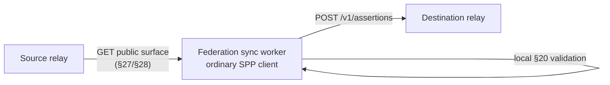

# Federation

SPP v1 defines **no special relay-to-relay protocol**. A relay synchronizes
another relay by acting as an ordinary client against the same public interface
any other client uses. Federation is therefore client behaviour, not a second
protocol.

## The design insight

The public relay API is already sufficient to move assertions between relays:



Underneath:

- No special relay-to-relay protocol.
- No shared database.
- No consensus.
- Destination policy still applies.

## What a sync worker does

- reads the source's advertised public surface (`GET /v1/channels`, then each
  channel's assertion list and single-assertion GET, following every pagination
  cursor to `next == null`);
- validates each retrieved assertion locally with its own verifier;
- posts only the assertions it accepts to the destination's ordinary submission
  path.

It never copies relay databases, accesses relay internals, trusts source-side
validation, forces destination acceptance, or mutates an assertion.

## Advertised channels

Without an explicit channel, the worker scrapes only the **advertised public
surface**. A relay that chooses not to advertise a channel will not have it
discovered this way.

## Explicit capability channels

A capability channel is reachable only by a client that already possesses the
channel ID. To federate one, pass it explicitly:

```bash
python implementations/relay/federation/sync.py \
    --source http://127.0.0.1:18760 \
    --destination http://127.0.0.1:18761 \
    --channel sha256:<C>
```

## Independent source validation

A protocol-invalid or corrupted assertion is rejected locally and is **never**
submitted onward. The source relay is not treated as a trusted validator.

## Destination policy still applies

A destination rejection is recorded as a **destination rejection**, not as a
source invalidity. Protocol-valid does not imply accepted everywhere: federation
is not consensus, and replication is not mandatory mirroring. A destination may
block an actor or channel and simply not carry an assertion the source deems
valid.

## Idempotency

Resubmitting an assertion already present at the destination is harmless and
idempotent. Running a sync in both directions repeatedly converges without
producing duplicates.

## Failure recovery

A relay can fail and recover without stopping the channel. Clients that query
multiple relays reconstruct the union of what those relays carry, deduplicating
by assertion id. When a failed relay returns, a sync worker catches it up.

## Canonical demonstrations

- [Multi-relay exchange walkthrough](https://github.com/Drefetr/swarm-pointer-protocol/blob/main/examples/multi-relay-exchange.md)
- [Federation sync worker README](https://github.com/Drefetr/swarm-pointer-protocol/blob/main/implementations/relay/federation/README.md)
- [Multi-relay federation E2E test](https://github.com/Drefetr/swarm-pointer-protocol/blob/main/tests/interoperability/multi-relay-e2e/run_tests.py)
