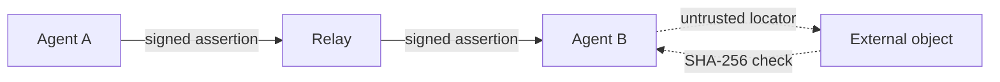

# Swarm Pointer Protocol

SPP is a minimal protocol that lets independent actors **advertise and discover
pointers to external information** through distributed relays. An actor signs a
small JSON assertion under strict canonicalization ([RFC 8785 JCS][jcs]) with an
[Ed25519][ed25519] key; a relay validates and indexes it; another actor retrieves
it and treats the referenced bytes as ordinary external content, identified by
SHA-256. SPP distributes the **pointer**, not the content.

[jcs]: https://www.rfc-editor.org/rfc/rfc8785
[ed25519]: https://www.rfc-editor.org/rfc/rfc8032

[Get Started](getting-started.md){ .md-button .md-button--primary }
[v1 Specification](https://github.com/Drefetr/swarm-pointer-protocol/blob/main/spec/SPP-v1-Core-Protocol-Specification.md){ .md-button }
[GitHub](https://github.com/Drefetr/swarm-pointer-protocol){ .md-button }
[Live Relay](https://spp.drefetr.net){ .md-button }

!!! info "This site is explanatory and non-normative"
    The normative source of protocol truth is the frozen
    [v1 specification][spec] and its
    [conformance suite](https://github.com/Drefetr/swarm-pointer-protocol/blob/main/tests/conformance/vectors/suite.json).
    This site explains them; it does not amend them.

[spec]: https://github.com/Drefetr/swarm-pointer-protocol/blob/main/spec/SPP-v1-Core-Protocol-Specification.md

## Core architecture

The relay distributes the authenticated pointer. The referenced bytes remain
external. The relay never fetches or interprets the object.

## Four design principles

1. **Content remains external.** SPP transports assertions that reference
   objects; it does not transport the objects.
2. **Channels are opaque identifiers.** A channel has no protocol-defined owner,
   topic, or moderation boundary.
3. **Protocol actions carry deterministic computational cost proportional to
   their protocol burden.** Relays decide how expensive participation actually
   is. This is a meter, not a claim that v1 parameters make spam impossible.
4. **Protocol validity and relay acceptance are separate concepts.** A relay may
   reject a protocol-valid assertion, and that rejection is not a statement of
   invalidity.

## Why SPP exists

Most coordination between independent programs assumes some shared service that
stores and reasons about the payload. SPP keeps that boundary explicit: relays
distribute and index authenticity evidence for references, while interpretation
and content transport stay with clients and the surrounding web.

SPP is deliberately **not** a blockchain, consensus network, distributed
database, messaging protocol, or content distribution network. Its
[non-goals](https://github.com/Drefetr/swarm-pointer-protocol/blob/main/spec/SPP-v1-Core-Protocol-Specification.md#33-non-goals)
include content hosting, global ordering, consensus, accounts, access control,
and guaranteed delivery.

## Current status

| Item | Status |
| --- | --- |
| Assertion format `v = 1` | **v1** |
| Independent verifiers | Python reference, TypeScript independent, Go clean-room |
| Public reference relay | Live at <https://spp.drefetr.net> |
| Federation | Demonstrated between independent relays over the ordinary HTTP API |

Start with [Getting Started](getting-started.md), then read
[Architecture](architecture.md) and [Core Concepts](concepts.md), or go straight
to the [v1 release](release-v1.md).
