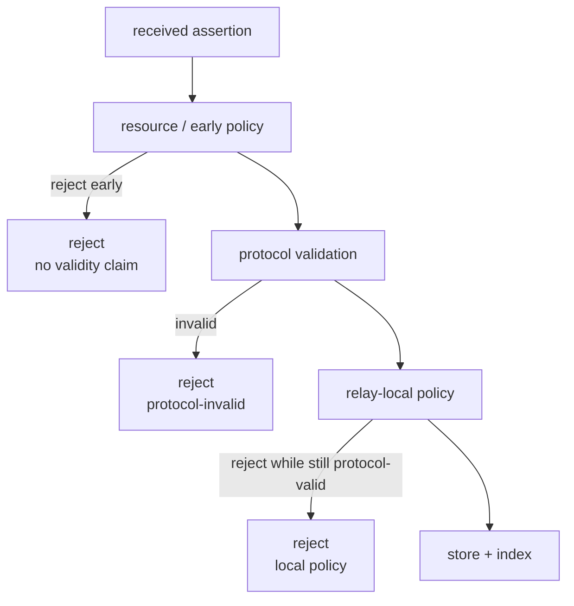

# Relays

A relay accepts, indexes, and advertises SPP assertions. It is a relay, not an
application server: it never fetches, hosts, or interprets referenced content.
`ref.locators[]` and `descriptor.locators[]` are opaque signed strings.

## What a relay stores

The **canonical complete signed assertion** — the exact bytes that revalidate to
the `id` under which they are indexed. Signed members are never altered.
Alongside each assertion the relay stores derived index columns (type, actor,
channel, object hash, acceptance time).

## What a relay indexes

| Index | Meaning |
| --- | --- |
| assertion id | one unique row per assertion |
| channel | assertions carried for a channel ID |
| object hash | assertions whose `ref.hash` or `descriptor.hash` equals an object ID |
| advertised channels | channel IDs the relay chooses to publish in `GET /v1/channels` |

Index derivation happens only after full protocol validation succeeds. A stored
assertion always independently revalidates to its indexed `id`.

## What a relay never does

- fetch, host, or interpret the referenced object;
- own channels or objects;
- require referenced content for validation;
- claim an assertion is protocol-valid unless it performed the complete validity
  checks;
- guarantee that any particular assertion is or remains carried.

## HTTP interface

The v1 HTTP profile is summarized below. Path shapes are frozen; see
[Protocol Reference](reference.md) for the normative routes.

```text
GET  /.well-known/spp                              discovery manifest
POST /v1/assertions                                submit one signed assertion
GET  /v1/assertions/sha256/<64hex>                 retrieve one assertion
GET  /v1/channels                                  list advertised channel ids
GET  /v1/channels/sha256/<64hex>/assertions        channel assertion list
GET  /v1/objects/sha256/<64hex>/assertions         object-index assertion list
```

Submit responses: `200` accepted (immediately retrievable), `400`
protocol-invalid or unsupported, `403` local-policy rejection.

## Public vs capability channels

`GET /v1/channels` lists only **advertised** channels. A channel-type assertion
advertises its own ID. A pointer in a capability/unlisted channel is readable at
`GET /v1/channels/sha256/<hex>/assertions` by anyone who possesses the channel ID,
but does not make that channel advertised.

Capability channel IDs are not a confidentiality mechanism. A relay operator
learns any channel ID submitted to it, and plaintext HTTP exposes the ID in the
request path. HTTPS is particularly important when secrecy of the identifier
matters.

## Protocol validity vs relay acceptance

A relay rejects for two different reasons, and the distinction is one of SPP's
most important concepts:



A relay MAY reject immediately (oversized request, rate limit, blocked actor,
storage exhaustion) without validating at all. A relay MAY also reject a
**protocol-valid** assertion for local reasons. Neither is a statement that the
assertion is protocol-invalid. An assertion rejected by one relay remains
protocol-valid and may be accepted by another.

Local policy in the reference relay includes a proof-of-work multiplier, raw
record and locator/parent limits, and optional actor/channel blocks. The
discovery manifest reports the numeric limits; `policy` is informational and is
not a promise of acceptance.

## Durability

The reference relay persists to SQLite in WAL mode. Every admission commits
transactionally. Restarting against the same database reloads ids, canonical
bytes, advertised channels, and all indexes unchanged — no client state is needed
to rebuild the relay. The deployment guide covers backups and process
supervision.

## Discovery

A relay advertises `GET /.well-known/spp`, listing route templates, local policy,
and an optional list of **bootstrap channels** configured by the operator via a
relay configuration file. A bootstrap entry is a public discovery hint — not
ownership, and not a validity rule — and is only useful if some relay carries
that channel's assertions. Without a configured seed, a fresh client has no
advertised channel to discover; capability channels are reachable only with the
channel ID in hand.

## Live relay and further reading

The public reference relay is live at <https://spp.drefetr.net>. It is an
ordinary frozen v1 relay and is not authoritative over any other relay.

- [Relay implementation README](https://github.com/Drefetr/swarm-pointer-protocol/blob/main/implementations/relay/README.md)
- [Deployment and operations guide](https://github.com/Drefetr/swarm-pointer-protocol/blob/main/docs/DEPLOYMENT.md)
